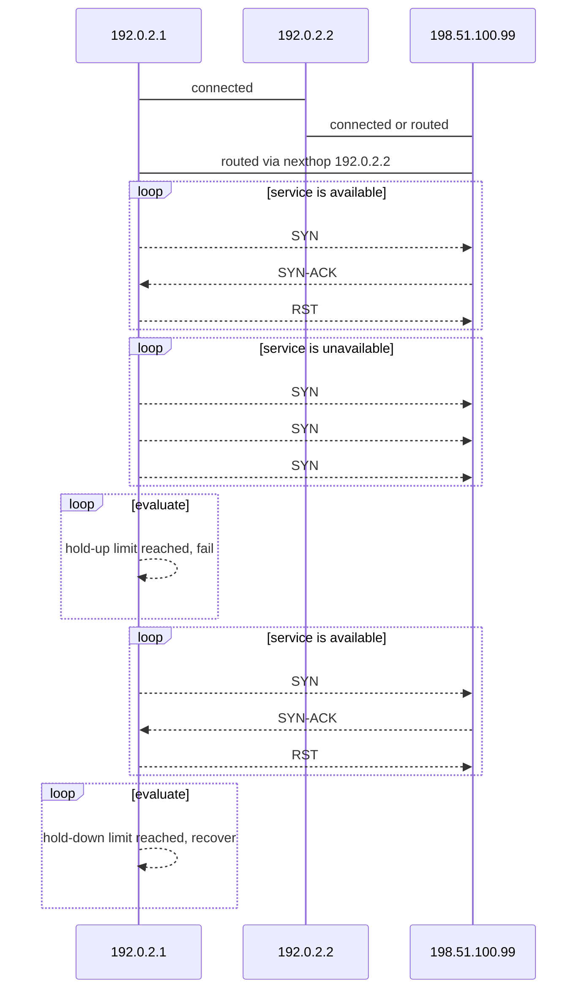

# SynAcktor

* [Overview](#overview)

## Overview

**SynAcktor** is an Arista [EOS extension](https://www.arista.com/en/um-eos/eos-section-6-6-managing-eos-extensions) that monitors TCP services and reacts to changes in service availability. SynAcktor can be configured to remove (static) routes to hosts with unavailable services, while still being able to watch for service restoration at a configurable interval.

### Flow




## Installation

SynAcktor is [installed](https://www.arista.com/en/um-eos/eos-section-6-6-managing-eos-extensions) as an EOS extension.

* Download the latest RPM from the [Releases](https://github.com/etedor/synacktor/releases) page.
* Copy the RPM to the device's flash storage (`/mnt/flash`).
* Copy the RPM from the flash storage to the extensions partition.

  ```other
  switch#copy flash:SynAcktor-2020.08.06-1.noarch.rpm extension:
  Copy completed successfully.
  ```

* Install the extension.

  ```other
  switch#extension SynAcktor-2020.08.06-1.noarch.rpm
  If this extension modifiers the behavior of the Cli, any running Cli sessions will
  need to be reset in order for the Cli modifications to take effect.
  ```

* Copy the extension into the boot-extensions partition.

  ```other
  switch#copy installed-extensions boot-extensions
  ```

## Configuration

SynAcktor is configured as an EOS daemon.

### Example

```other
daemon SynAcktor
   exec /usr/local/bin/SynAcktor
   option conf-fail value /mnt/flash/fail.conf
   option conf-recover value /mnt/flash/recover.conf
   option dport value 443
   option hold-down value 3
   option hold-up value 1
   option interval value 3
   option ip value 198.51.100.99
   option nexthop value 192.0.2.2
   option vrf value WEB
   no shutdown
```

### Options

| option       | description                                                         | type | min | max   | default   | required |
|--------------|---------------------------------------------------------------------|------|-----|-------|-----------|----------|
| dport        | TCP port of the target service                                      | int  | 1   | 65535 | None      | True     |
| hold-down    | number of successful scans before a service is considered recovered | int  | 1   | 60    | 3         | False    |
| hold-up      | number of missed scans before a service is considered failed        | int  | 1   | 60    | 3         | False    |
| interval     | wait `interval` seconds between performing each scan                | int  | 3   | 60    | 5         | False    |
| ip           | IP address of the target device                                     | ip   |     |       | None      | True     |
| nexthop      | next gateway to which packets should be forwarded                   | ip   |     |       | None      | True     |
| conf-fail    | path to configuration file used for failure                         | path |     |       | None      | True     |
| conf-recover | path to configuration file used for recovery                        | path |     |       | None      | True     |
| vrf          | VRF from which packets should originate                             | str  |     |       | `default` | False    |
